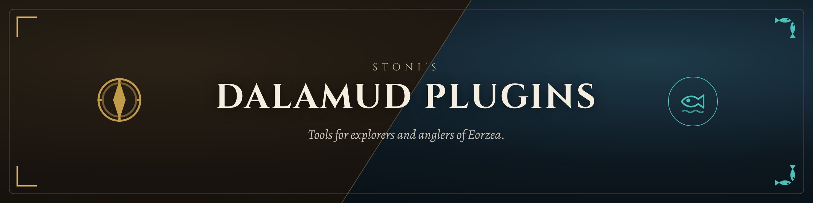
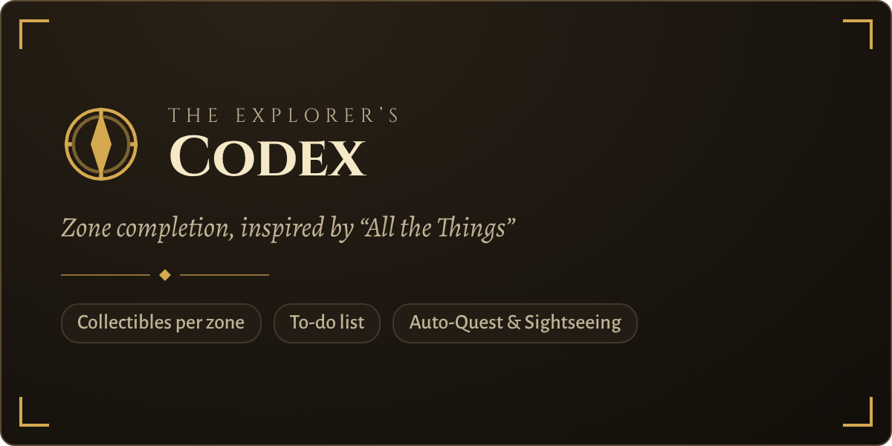
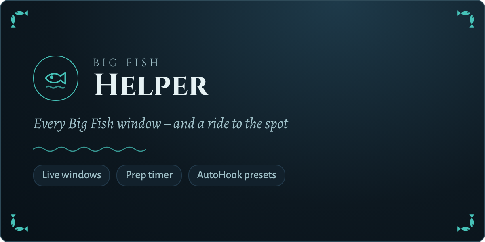

<p align="center">
  
</p>

<p align="center">
  <b>A custom Dalamud plugin repository for Final Fantasy XIV.</b><br>
  Add it once, and every plugin below shows up in your plugin installer, with automatic updates.
</p>

<p align="center">
  
  
  
</p>

---

## 📦 Add the repository

1. In game, open the Dalamud settings with `/xlsettings` and go to **Experimental**.
2. Under **Custom Plugin Repositories**, paste this URL and click **+**:
   ```
   https://raw.githubusercontent.com/stoni89/DalamudPlugins/main/repo.json
   ```
3. Click **Save**, then open the plugin installer with `/xlplugins`.
4. Search for the plugin you want and click **Install**.

> [!IMPORTANT]
> Only add repositories you trust. Custom plugins are not reviewed by the Dalamud team.

---

## 🧰 Plugins

<table>
  <tr>
    <td width="50%" valign="top">
      <a href="https://github.com/stoni89/explorers-codex"></a>
      <p>
        <a href="https://github.com/stoni89/explorers-codex/releases"></a>
        <a href="https://github.com/stoni89/explorers-codex/issues"></a>
      </p>
      <p>
        <b>The Explorer's Codex</b>: a per-zone completionist plugin, inspired by <i>All the Things</i> from WoW.
        Shows every mount, minion, card and vista you are still missing in your current zone, with a to-do list and automation.
      </p>
      <p><code>/exc</code> · <a href="https://github.com/stoni89/explorers-codex">Read more →</a></p>
    </td>
    <td width="50%" valign="top">
      <a href="https://github.com/stoni89/big-fish-helper"></a>
      <p>
        <a href="https://github.com/stoni89/big-fish-helper/releases"></a>
        <a href="https://github.com/stoni89/big-fish-helper/issues"></a>
      </p>
      <p>
        <b>Big Fish Helper</b>: tracks every Big Fish window and works together with AutoHook.
        Plan your fish, and it flies you to the spot in time and fishes with the right preset.
      </p>
      <p><code>/bigfish</code> · <a href="https://github.com/stoni89/big-fish-helper">Read more →</a></p>
    </td>
  </tr>
  <!--
    Neues Plugin: neue <tr> beginnen, sobald eine Zeile zwei Karten hat.
    Karte: assets/card-<name>.png (1200×600), Version- und Issues-Badge auf das
    Plugin-Repo, 2 Sätze Beschreibung, Befehl + "Read more →".
    Danach das Badge "plugins-N" oben hochzählen und unter "Feedback & bug reports"
    den Issues-Link ergänzen.
  -->
</table>

---

## 🔄 Updates

Every plugin publishes its releases automatically. The release workflow of each plugin updates `repo.json` in this repository, so Dalamud picks up new versions on its own. You don't need to do anything.

---

## 💬 Feedback & bug reports

Please open issues in the repository of the plugin they are about:

- [The Explorer's Codex – issues](https://github.com/stoni89/explorers-codex/issues)
- [Big Fish Helper – issues](https://github.com/stoni89/big-fish-helper/issues)

---

<p align="center">
  <sub>FINAL FANTASY is a registered trademark of Square Enix Holdings Co., Ltd. These projects are not affiliated with or endorsed by Square Enix.</sub>
</p>
